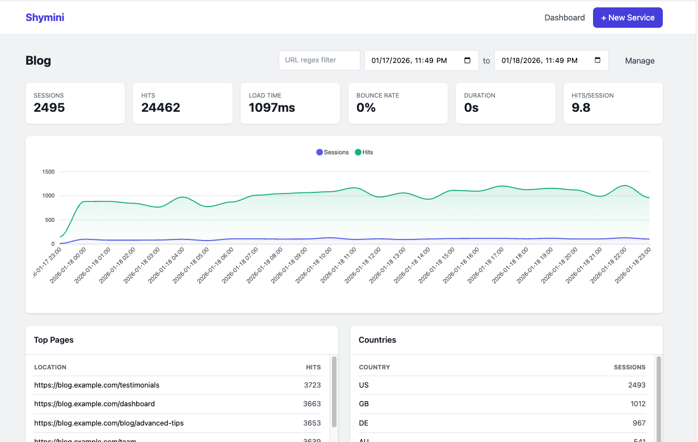

# shymini



A tiny, self-hosted analytics tool. Handles analytics for sites with 10s of thousands (possibly hundreds of thousands) of daily visitors with ease, while respecting user privacy.
See our [loadtest](./src/bin/loadtest.rs) for more. Leverages good ol' SQLite _or_ PostgreSQL, which are not usually the analytics tools of choice, but more than adequate for basic analytics stats.

## Features

- **Privacy-focused**: Respects DNT/GPC headers, configurable IP collection
- **Lightweight**: Single binary, minimal resource usage
- **Database support**: SQLite first, PostgreSQL via feature flags
- **GeoIP**: Optional MaxMind GeoIP2 integration
- **Real-time**: In-memory caching with moka, no Redis required

This project is deeply inspired by [shynet](https://github.com/milesmcc/shynet), with a direct homage via the name.
`shynet` is the closet thing to an analytics tool that I personally liked, but I wanted something even more minimal & easier to self-host.
`shymini` drops key features and is currently a less polished and less feature rich variant. We don't support
auth* or user management at this time, and the frontend is basic, albeit allows some interactivity! Need authentication? Apply it at your router layer (such as Caddy, Nginx, Traefik, etc). Authorization features will never be supported.
Assuming basic analytic capability, simplicity is the primary goal, &
performance in a low-resource environment is secondary. The release binary currently runs in ~5 MBs, idle. Ya baby! No extra services required.

## Quick Start

### Using Docker Compose

```bash
docker-compose up -d
```

Visit http://localhost:8080

### Building from Source

```bash
# SQLite (default)
cargo build --release

# PostgreSQL
cargo build --release --features postgres --no-default-features
```

### Running

```bash
# Copy and edit configuration
cp .env.example .env

# Run the server
cargo run --release
```

## Configuration

All configuration is done via environment variables with the `SHYMINI__` prefix:

| Variable | Default | Description |
|----------|---------|-------------|
| `SHYMINI__HOST` | `0.0.0.0` | Server bind address |
| `SHYMINI__PORT` | `8080` | Server port |
| `SHYMINI__DATABASE_URL` | - | PostgreSQL connection URL |
| `SHYMINI__DATABASE_PATH` | shymini.db?mode=rwc | SQLite database file path |
| `SHYMINI__MAXMIND_CITY_DB` | - | Path to GeoLite2-City.mmdb |
| `SHYMINI__MAXMIND_ASN_DB` | - | Path to GeoLite2-ASN.mmdb |
| `SHYMINI__BLOCK_ALL_IPS` | `false` | Never store IP addresses |
| `SHYMINI__AGGRESSIVE_HASH_SALTING` | `false` | Add service ID and date to session hash |
| `SHYMINI__SCRIPT_HEARTBEAT_FREQUENCY_MS` | `5000` | Heartbeat interval in milliseconds |
| `SHYMINI__CACHE_MAX_ENTRIES` | `10000` | Maximum cache entries per cache type |
| `SHYMINI__CACHE_TTL_SECS` | `3600` | Cache TTL in seconds |
| `SHYMINI__SESSION_MEMORY_TIMEOUT_SECS` | `1800` | Session association cache TTL |

## Usage

### Adding Tracking to Your Website

Open the GUI, e.g. https://your-shymini-instance, and select "Add Service" to create a new tracking service for your website.
It will specify a script OR pixel tracker to add to your site. For example:

```html
<script defer src="https://your-shymini-instance/app_TRACKING_ID.js"></script>
<!-- or -->

```

The `TRACKING_ID` is a short 8-character code (e.g., `abc12345`) shown in your service settings.

### API Endpoints

| Endpoint | Description |
|----------|-------------|
| `GET /api/services` | List all services |
| `GET /api/services/:id` | Get service details |
| `GET /api/services/:id/stats` | Get service statistics |
| `GET /api/services/:id/sessions` | List service sessions |
| `GET /api/sessions/:id` | Get session details |
| `GET /api/sessions/:id/hits` | List session hits |

## Load Testing

A built-in load test binary seeds realistic analytics data and benchmarks query performance.

```bash
# Seed database with default settings (5 services × 100k hits × 10k sessions each)
cargo run --release --bin loadtest -- seed

# Seed with custom settings
cargo run --release --bin loadtest -- seed --hits 50000 --sessions 5000 --services 10

# Run benchmarks on existing database
cargo run --release --bin loadtest -- bench --db ./loadtest.db

# Seed and immediately benchmark
cargo run --release --bin loadtest -- seed --bench

# Start server with the seeded database
SHYMINI__DATABASE_PATH=./loadtest.db cargo run --release
```

**Options:**

| Option | Default | Description |
|--------|---------|-------------|
| `--db <path>` | `loadtest.db` | Database file path |
| `--hits <n>` | `100000` | Hits per service |
| `--sessions <n>` | `10000` | Sessions per service |
| `--services <n>` | `5` | Number of services to create |
| `--days <n>` | `7` | Days of history to generate |
| `--bench` | - | Run benchmarks after seeding |

## License

See [LICENSE](./LICENSE) & [NOTICE](./NOTICE) files for licensing details.
